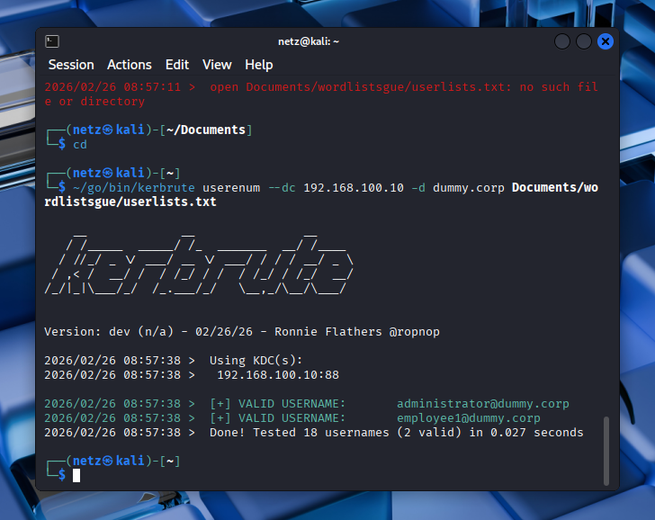
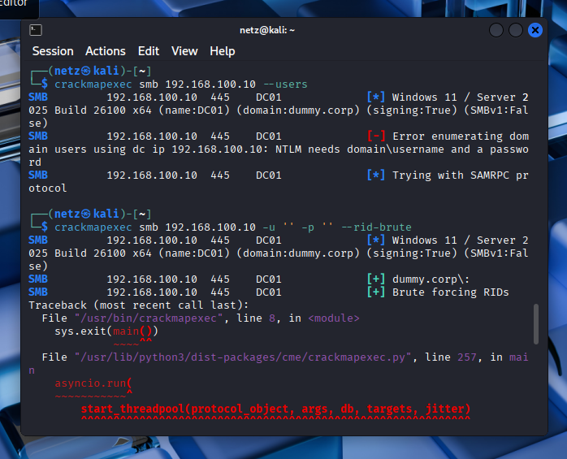
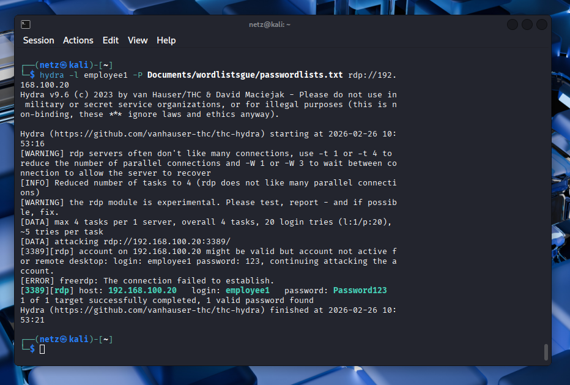
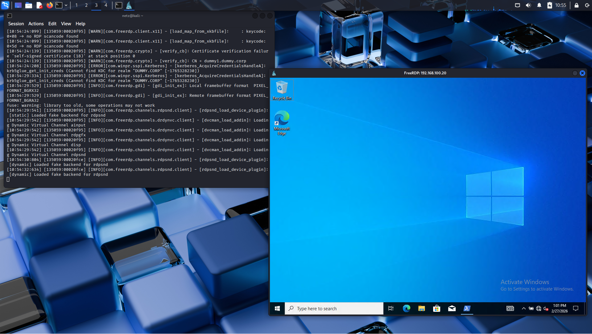
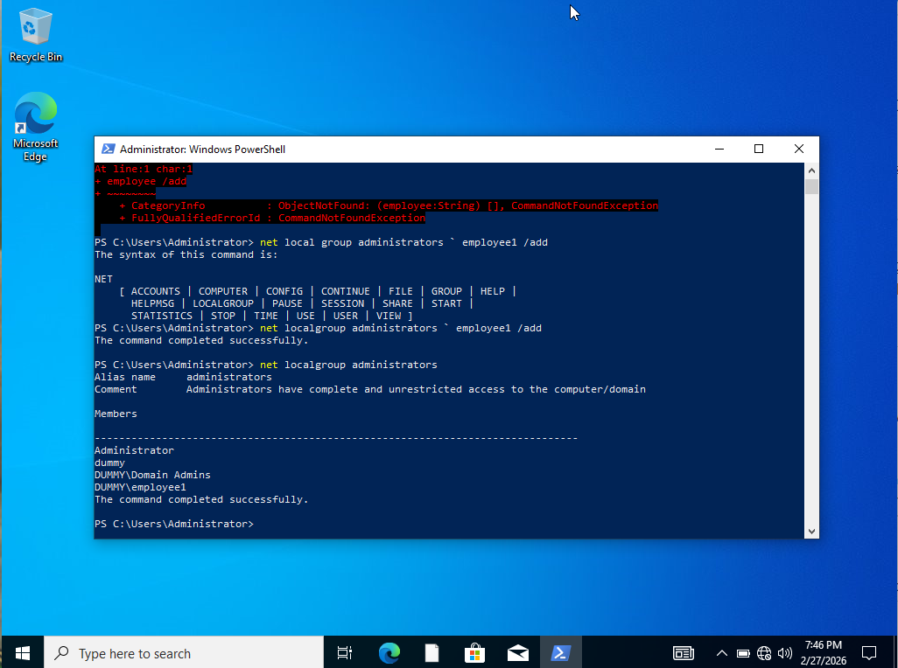
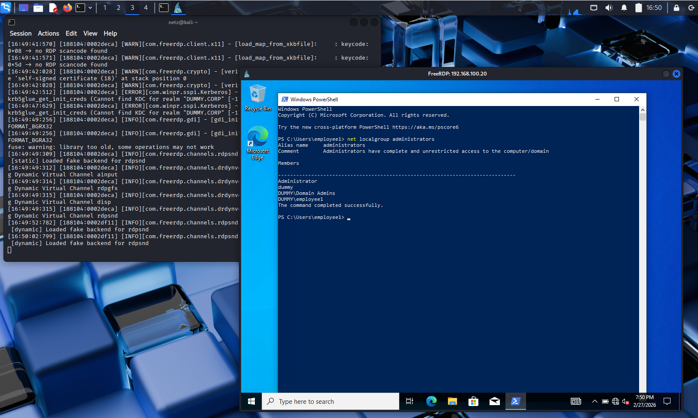

# Windows-10-Crendential-Attack-Lab

## Overview
This repository is my university project about simulating credential dumping and privilege escalation in a Windows Active Directory environment

The attack does NOT rely on software vulnerabilities, but instead exploits:
- Weak password
- Cached credentials
- Unsafe administrator behavior

---

## Lab Environment
- Windows Server (Domain Controller) 
- Windows 10 (Client)
- Kali Linux (Attacker)
- VirtualBox

---

## Tools Used
- Nmap
- Kerbrute
- CrackMapExec
- THC Hydra
- Mimikatz

---

## Attack Flow
### 1. Reconnaissance (Nmap)
The attacker scans the Domain Controller to identify open ports and services such as Kerberos, LDAP, SMB, and DNS. 

Scanning the network using command:

```nmap -sn 192.169.100.0/24```

And scanning open port using command:

```nmap -p 88,445,53 192.168.100.0/24```


### 2. Username Enumeration (Kerbrute)
Kerbrute is used to identify valid  usernames in the domain without requiring passwords.

Using the command:

```usernum --dc 192.168.100.10 -d dummy.corp Documents/wordlistsgue/userlists.txt```



### 3. SMB Enumeration (CrackMapExec)
CrackMapExec is used to gather information from the Domain Controller via SMB services.

Trying anonymous access to the Domain Controller and enumerate valid users by brute-forcing RID values over SMB using the command:

```crackmapexec smb 192.168.100.10 -u '' -p '' --rid-brute```



### 4. Password Brute Force (Hydra)
A brute-force attack is performed against the RDP service using the valid username.

Trying to brute force the password for user ```employee1``` on the RDP service until one works using the command:

```hydra -l employee1 -P Documents/wordlistsgue/passwordlists.txt rdp://192.168.100.20```



### 5. Initial Access (RDP Login)
Using the discovered credentials from before, the attacker successfully logged into the Windows 10 workstation via RDP using the command:

```xfreerdp /u:employee1 /p:password123 /v:192.169.100.20```



### 6. privilege Escalation
Since the Domain Administrator previously logged into the system, credentials are cached and can be extracted.



---

Result
Full domain compromise achieved by:
- Reusing cached Domain Admin credentials
- Adding attacker-controlled user into Domain Admin Group

---

## Security Lessons
- Enforce strong password policies
- Avoid admin login on user machines
- Restrict RDP access

--- 

## Full report
See the full documentation here:
--> [ProjectWindowsActiveDirectoryPentest](./ProjectWindowsActiveDirectoryPentest.pdf) <--

---

Author 
- Haikal Raihan Hafidz (KiMiRoTa)
