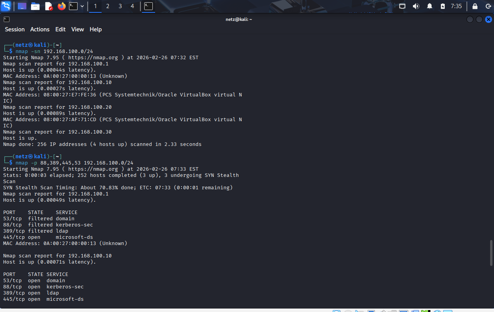
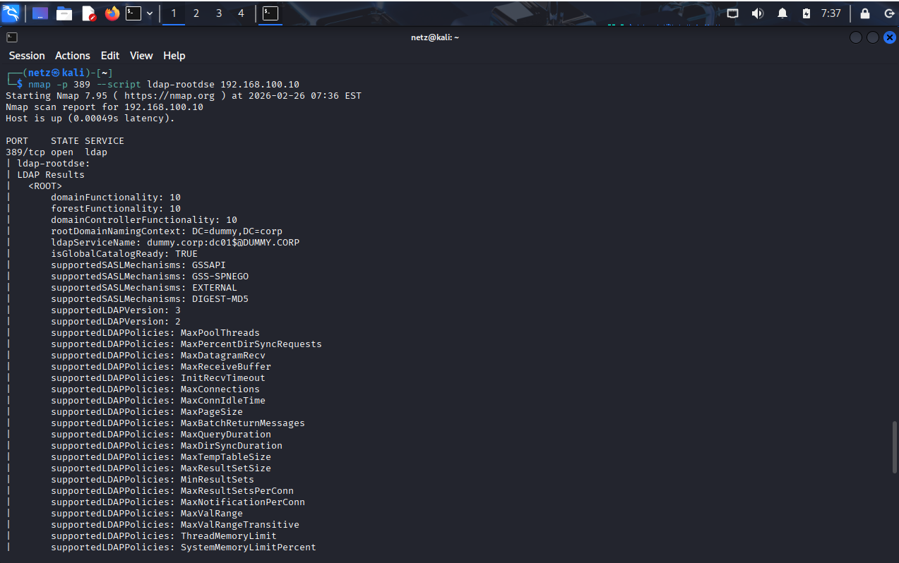
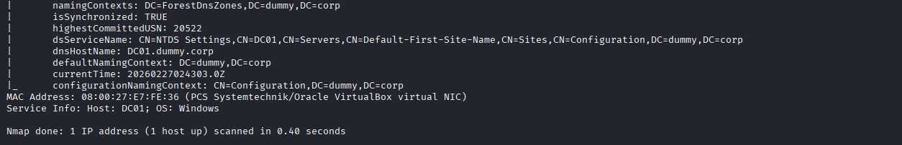

# WIndows-Crendential-Attack-Lab

## Overview
This repository is my university project about simulating credential dumping and privilege escalation in a Windows Active Directory environment

The attack does NOT rely on software vulnerabilities, but instead exploits:
- Weak password
- Cached credentials
- Unsafe administrator behavior

---

## Lab Environment
- Windows Server (Domain Controller) 
- Windows 10 (Client)
- Kali Linux (Attacker)
- VirtualBox

---

## Tools Used
- Nmap
- Kerbrute
- CrackMapExec
- THC Hydra
- Mimikatz

---

## Attack Flow
### 1. Reconnaissance (Nmap)
Scanning the Domain Controller to identify open services.

### 2. Username Enumeration (Kerbrute)
Identifying valid domain users without needing passwords.

### 3. Password Brute Force (Hydra)
Brute-forcing RDP login credentials.

---

Result
Full domain compromise achieved by:
- Reusing cached Domain Admin credentials
- Adding attacker-controlled user into Domain Admin Group

---

## Security Lessons
- Enforce strong password policies
- Avoid admin login on user machines
- Restrict RDP access

--- 

## Full report
See the full documentation here:
--> [ProjectWindowsActiveDirectoryPentest](./ProjectWindowsActiveDirectoryPentest.pdf) <--

---

Author 
- KiMiRoTa
